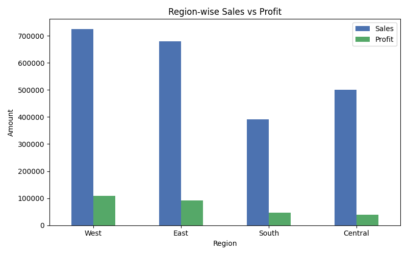
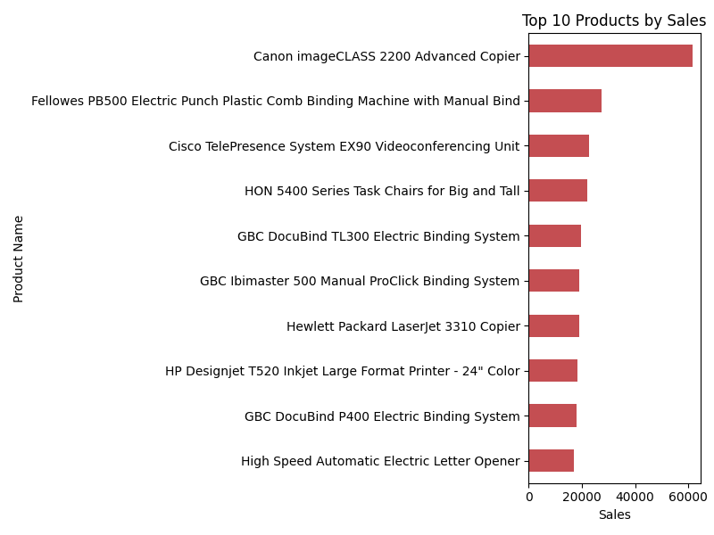

# 📊 Superstore Sales Analysis

Exploratory Data Analysis (EDA) on retail sales data using **Python** and **Pandas**, uncovering regional profitability trends and top-performing products.

## 🧾 Overview

This project analyzes ~10,000 retail transactions to answer key business questions:
- Which products generate the most revenue?
- Which regions are most (and least) profitable?
- Where is the business losing profit margin despite strong sales?

## 🛠️ Tools & Libraries

- **Python** (Pandas, Matplotlib)
- **Google Colab / Jupyter Notebook**
- **Dataset:** [Sample Superstore Dataset (Kaggle)](https://www.kaggle.com/datasets)

## 🔍 Key Steps

1. Loaded and inspected the dataset (9,994 rows, 21 columns, no missing values)
2. Converted date columns and cleaned data types
3. Identified top 10 best-selling products by total sales
4. Compared sales and profit across regions
5. Visualized findings with bar charts

## 📈 Key Insights

**Top Products:** Office equipment and furniture (copiers, binding machines, task chairs) dominate the top 10 by revenue — not everyday small items.

**Region-wise Performance:**

| Region  | Sales      | Profit     |
|---------|-----------|------------|
| West    | ₹7.25L    | ₹1.08L     |
| East    | ₹6.79L    | ₹0.92L     |
| South   | ₹3.92L    | ₹0.47L     |
| Central | ₹5.01L    | ₹0.40L     |

**Business Insight:** Central region generates higher sales than South, but its profit is nearly the same — indicating a weaker profit margin (~8% vs West's ~15%). This suggests Central may need a review of discounting strategy or cost structure.

## 📊 Visualizations

**Region-wise Sales vs Profit**

**Top 10 Products by Sales**

## 📁 Files

- `sales_analysis.ipynb` — Full analysis notebook
- `region_chart.png` — Regional sales/profit visualization
- `top_products_chart.png` — Top products visualization

## 🚀 Future Improvements

- Add customer segment-level analysis
- Build an interactive dashboard (Tableau/Power BI)
- Time-series analysis of monthly sales trends

---
**Author:** Mukund Singh  
[LinkedIn](https://www.linkedin.com/in/mukund-singh-2b626b396) | [GitHub](https://github.com/mukund2singh-dev)
